Parts Implemented by Burak Balta
================================
    There are also three objects as everyone has the same number objects for this project. It is thought that for athletic games there should be *Users* option which should have country for the teams. *athletes* is another object is for all teams, so its attributes are name, surname and contry. Therefor athlete table refers the teams table. Lastly, *statistics* is also objects as a table in project, and it has distance, time and id_athlete attributes which shows all statistic table for athletes. Therefor, statistics table refers the athletes table.

Users Operations
****************
 Users is the attiribute for teams table. There are  add, delete, search and update operations for the teamss.

1. `Add an User`_
2. `Delete an User`_
3. `Update an User`_
4. `Search an User`_

    *Accessing Users Operations*

Add an User
+++++++++++
  In order to add insert a user to Users table, user name and the password of the user which are Users table's attributes should be added and the button must be pressed. User would be added.

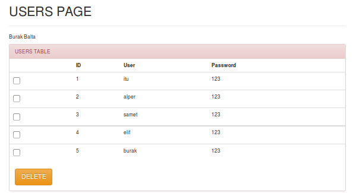

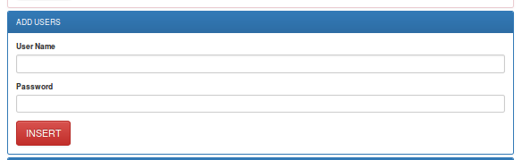

   *Add an user*

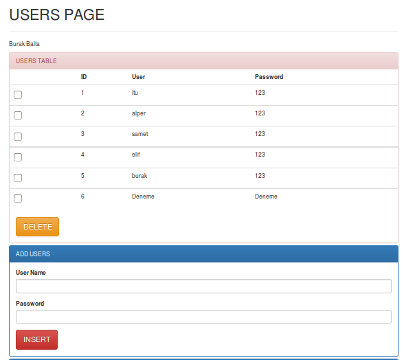

Delete an User
++++++++++++++
   In order to remove an user from Users table, the selection of the user and pressing the delete button would realize the deletion operation from the table.

       *delete an user with checkbox*

Update an User
++++++++++++++
    In order to update the already presented user on the table, id, username and password should be written in text boxes and after that, pressing the update button simply would realize the update operation on the table.

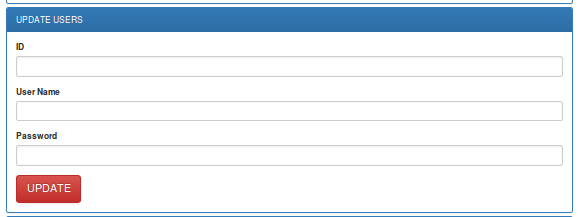

    *update a team*

Search an User
++++++++++++++
    In order to realize search operation, the textbox is filled and search button is pressed. Then the user which is searched will be appeared separately simply.

    *Searching a Team*

News Operations
***************
There are id, title, content and country as attributes in the News table. There are add,  delete , search and update options for the News.

1. `Add a News`_
2. `Delete a News`_
3. `Update a News`_
4. `Search a News`_

    *Accessing News Operations*

Add a News
++++++++++
  In order to add insert a news to news table, title, content and country should be given.

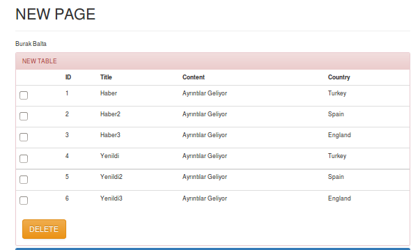

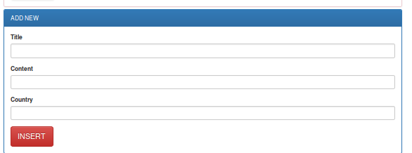

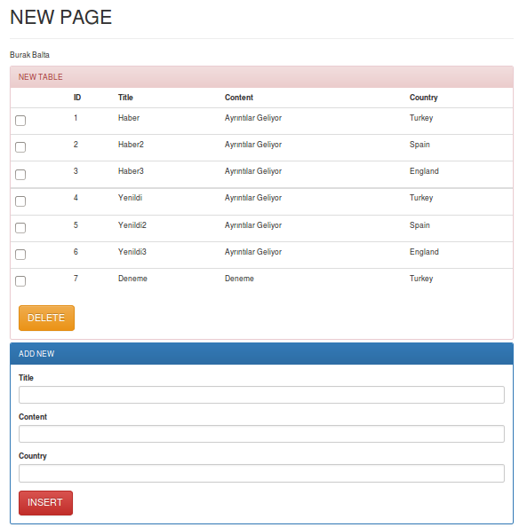

Delete a News
+++++++++++++
   In order to remove a news from athletes table, the selection of the news from checkbox and pressing the delete button would realize the deletion operation from the table.

       *add a News*

Update a News
+++++++++++++
    In order to update the already presented news on the table, id, title and content are written in text boxes after that, pressing the update button simply would realize the update operation on the table.

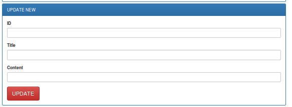

    *update a News*

Search a News
+++++++++++++
    In order to realize search operation, the textbox is filled and search button is pressed.

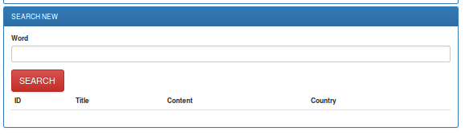

    *searching a Athlete*

Comments Operations
*******************
There are distance id, id_new, article and names as attribute in comments table. There are add, delete, search and update options.

1. `Add a Comment`_
2. `Delete a Comment`_
3. `Update a Comment`_
4. `Search a Comment`_

    *Accessing Comments Operations*

Add a Comment
+++++++++++++
  In order to add insert a comment to comments table, name and article should be written and the insert button should be clicked.

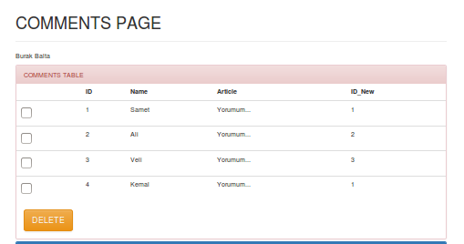

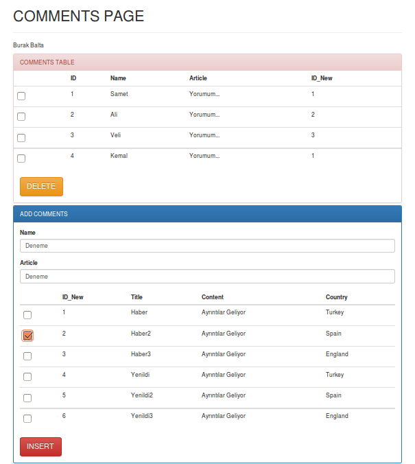

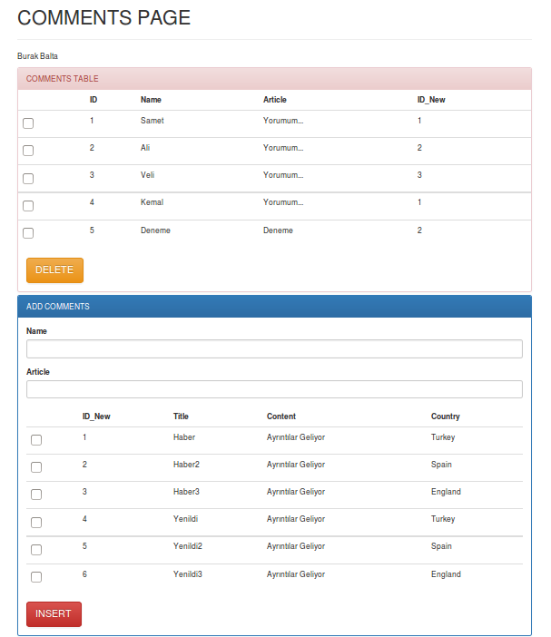

    *Delete a Comment*

Delete a Comment
++++++++++++++++
   In order to remove a comment from statistics table, the selection of the comment from checkbox and pressing the delete button would realize the deletion operation from the table.

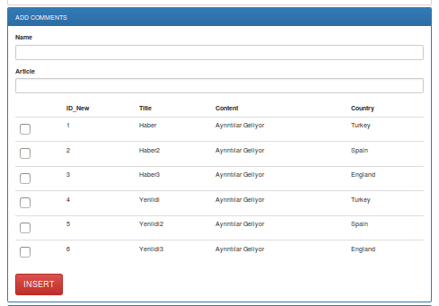

       *add a Comment*

Update a Comment
++++++++++++++++
    In order to update the already presented comment on the table, id, name and article should be written.

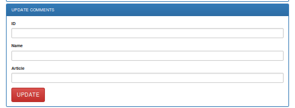

    *update a Comment*

Search a Comment
++++++++++++++++
    In order to realize search operation, the textbox is filled and search button is pressed. Then the statistic which is searched will be appeared separately simply.

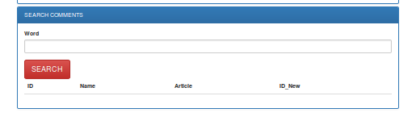

    *searching a Comment*
