Parts Implemented by SAMET AYALTI
=================================
    There are also three objects as everyone has the same number objects for this project. It is thought that for athletic games there should be *teams* option which should have country for the teams. *athletes* is another object is for all teams, so its attributes are name, surname and contry. Therefor athlete table refers the teams table. Lastly, *statistics* is also objects as a table in project, and it has distance, time and id_athlete attributes which shows all statistic table for athletes. Therefor, statistics table refers the athletes table.

Teams Operations
****************
 Country is the attiribute for teams table. There are  add, delete, search and update operations for the teamss.

1. `Add a Team`_
2. `Delete a Team`_
3. `Update a Team`_
4. `Search a Team`_

    *Accessing Teams Operations*

Add a Team
++++++++++
  In order to add insert a team to teams table, country is written which are Teams' attributes, and press add button. Team would be added.

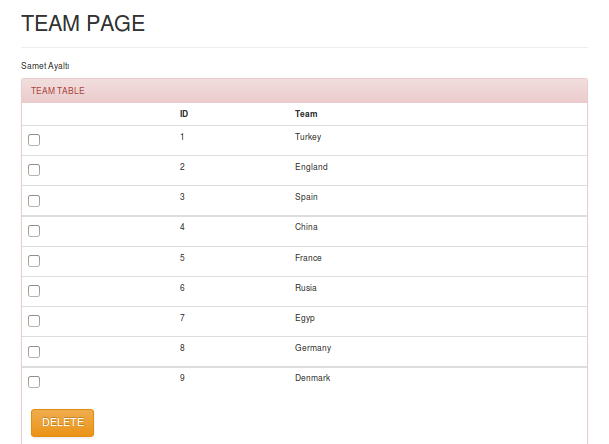

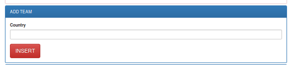

*Delete a Feedback*
   After Add "USA" a feedback:

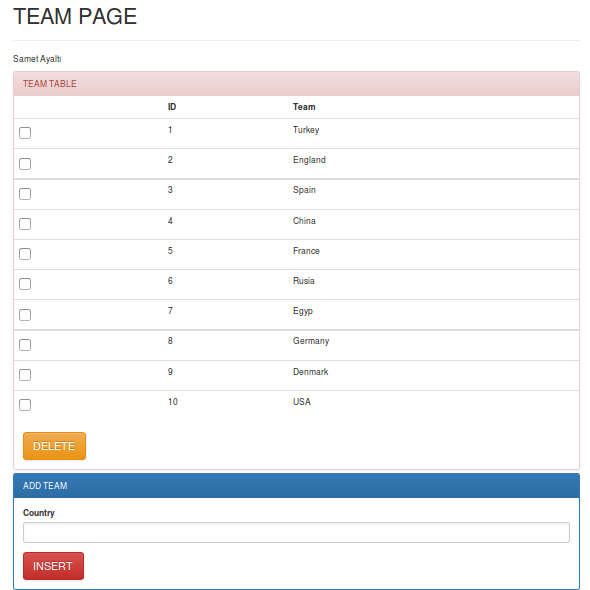

Delete a Team
+++++++++++++
   In order to remove a team from teams table, the selection of the team and pressing the delete button would realize the deletion operation from the table.

       *add a team*

Update a Team
+++++++++++++
    In order to update the already presented team on the table, id and country are written in text boxes after that, pressing the update button simply would realize the update operation on the table.

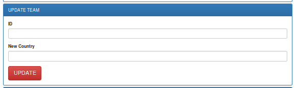

    *update a team*

Search a Team
+++++++++++++
    In order to realize search operation, the textbox is filled and search button is pressed. Then the team which is searched will be appeared separately simply.

    *Searching a Team*

Athletes Operations
*******************
There are name, surname and country as attributes in athletes table. There are add,  delete , search and update options for the athletes.

1. `Add a Athlete`_
2. `Delete a Athlete`_
3. `Update a Athlete`_
4. `Search a Athlete`_

    *Accessing Athletes Operations*

Add a Athlete
+++++++++++++
  In order to add insert a athlete to athletes table. name, surname and country are written which are Athletes' attributes, and press add button. Athlete would be added.

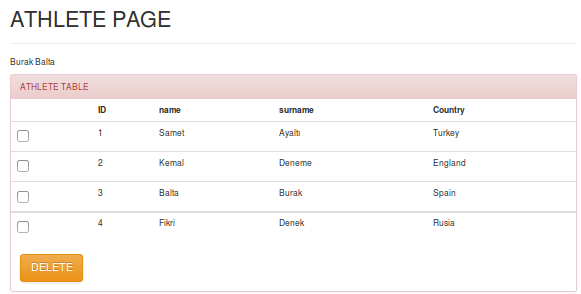

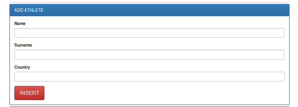

*Delete a Feedback*
   After Add "Deneme" a feedback:

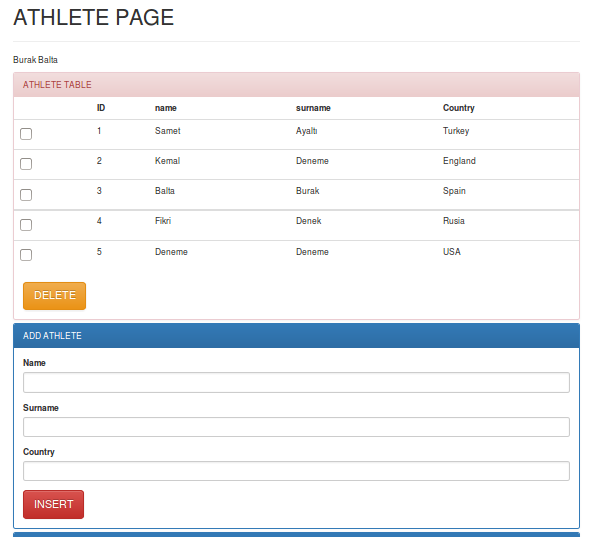

Delete a Athlete
++++++++++++++++
   In order to remove a athlete from athletes table, the selection of the athlete and pressing the delete button would realize the deletion operation from the table.

       *add a Athlete*

Update a Athlete
++++++++++++++++
    In order to update the already presented athlete on the table, id, team1 and team2 are written in text boxes after that, pressing the update button simply would realize the update operation on the table.

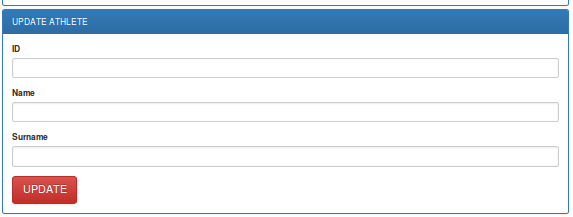

    *update a Athlete*

Search a Athlete
++++++++++++++++
    In order to realize search operation, the textbox is filled and search button is pressed. Then the athlete which is searched will be appeared separately simply.

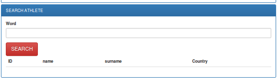

    *searching a Athlete*

Statistics Operations
*********************
There are distance,time and id_athlete as attribute in statistics table. There are add, delete , search and update options for the statistics.

1. `Add a Statistic`_
2. `Delete a Statistic`_
3. `Update a Statistic`_
4. `Search a Statistic`_

    *Accessing Statistics Operations*

Add a Statistic
+++++++++++++++
  In order to add insert a statistic to statistics table, distance andtime are written after is chosen athlete with check-box which are Statistics' attributes, and press add button. Statistic would be added.

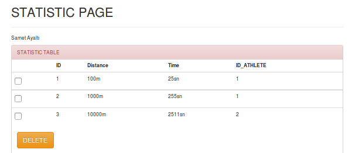

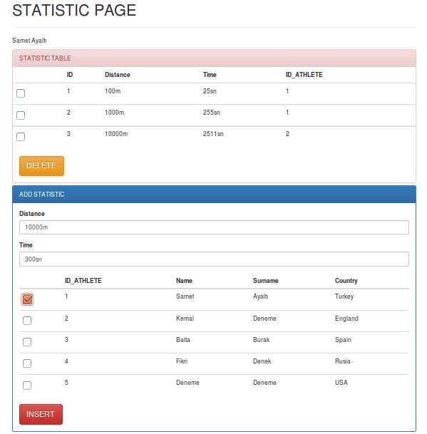

*Delete a Feedback*
   After Add "Deneme" a feedback:

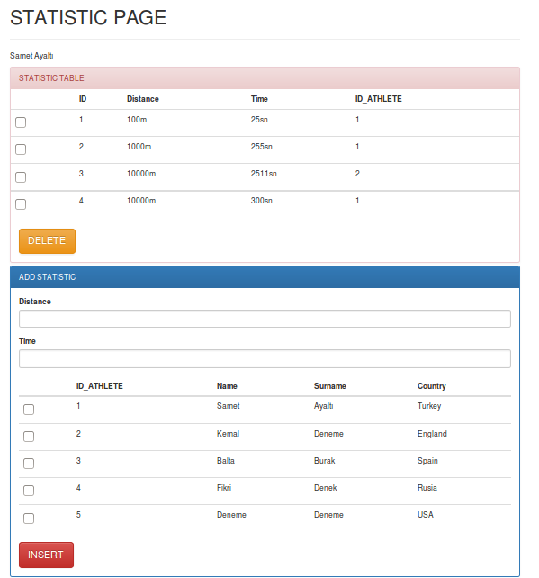

    *Delete a Statistic*

Delete a Statistics
+++++++++++++++++++
   In order to remove a statistic from statistics table, the selection of the statistic and pressing the delete button would realize the deletion operation from the table.

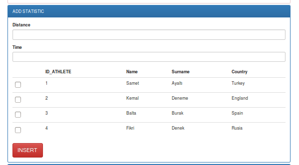

       *add a Statistic*

Update a Statistics
+++++++++++++++++++
    In order to update the already presented statistic on the table, id, distance and time are written in text boxes after that, pressing the update button simply would realize the update operation on the table.

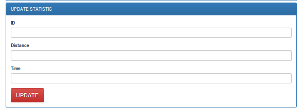

    *update a Statistic*

Search a Statistics
+++++++++++++++++++
    In order to realize search operation, the textbox is filled and search button is pressed. Then the statistic which is searched will be appeared separately simply.

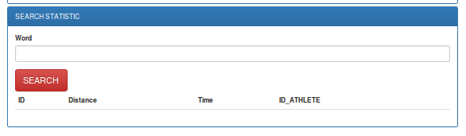

    *searching a Statistic*
